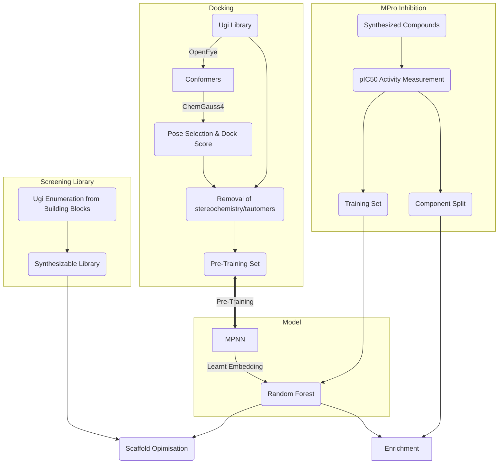

# Work journal for Ugi GNN project

Using learnt embeddings from GNNs pretrained on docking scores to predict pIC50 for enrichment. Two cases are considered: Compounds from the Ugi reaction as SARS-CoV-2 Mpro inhibitors, as well as \<insert protein target here.\>

## Backlog

- [ ] Write tests for data loading and other utility functions
- [ ] Weigh data by dockscore - how much of a difference does it make to the model performance?
- [x] Begin model training

## Log

2 Mar - Tested preprocessing of graphs, completely unfeasible: 12M `.csv` mapped to 2.3G of `.bin` graphs, will have to implement multithread instead.

1 Mar - Wrote notebooks to visualise ultra-large docking datasets, pickled slightly preprocessed dataframes for fast loading, began thinking about starting training

28 Feb - Downloaded CDK2 dataset of IC50s (Alpha will ask John Chodera to dock) and I have downloaded datasets from Stoichet Nature paper on Ultra-Large docking to D4 Dopamine receptor and AmpC beta-lactamase.

## Workflow for Ugi compounds

## Datasets

The datasets used in this work all consist of compounds generated from the Ugi reaction:

This one-step reaction reaction allows rapid construction of a virtual screening library by enumerating each of the four reactants (carboxylic acid, amine, ketone/aldehyde, isocyanide).

A 7.2M library of Ugi compounds comprising 263 carboxylic acids, 4215 amines, 30 aldehydes, 363 isocyanides (non-uniformly sampled) was docked against the SARS-CoV-2 Mpro receptor, and the docking scores were used to pre-train a GNN for down-stream prediction of protein binding. Tautomers and stereoisomers were enumerated for each compound, each giving different docking scores and expanding the dataset size to ~17M datapoints. The lowest (mean?) dock score for the generic smiles of the compound was used as the target value.

For training of a model for protein binding, inhibition data recorded from synthesized Ugi compounds from the COVID Moonshot project was used. These compounds are generated by holding three components of the Ugi reaction fixed and "exploring" along one of the axes. For evaluation of the trained model, instead of random splits of the training data a "component split" was performed. In this form of splitting, the held-out evaluation set is an exploration along one of the axes to assess the ability of the model to perform SAR analysis (measured via enrichment).

After the model was trained, exploratory scaffold optimisation was performed by virtually screening libraries constructed to explore along Ugi component directions. Based on medical chemistry expertise regarding binding of the compounds to the binding site, it was determined that the amine and acid components were most promising for optimisation. The most potent Ugi scaffold was taken and its components swapped with convenient & commercially available carboxylic acid and amine building blocks to construct screening libraries of size 198+344 (`p4_picks`) & 4008 (`amine_products`).

## Molecular Docking

The following is the description provided from the Chodera lab about the workflow and scripts used to perform the constrained docking of the Ugi library. The files in question are kept in `docking_files`, also containing scripts for further preprocessing of the generated files (conversion from `.bz2` to `.sdf`, extraction of SMILES/dock_score as `.csv`, concatenation of the chunks.)

### Manifest

* `total_ugi_library.csv` - the Ugi library (SMILES)
* `dock-all-chunks.sh` - LSF script to dock chunks of the library
* `dock-chunk.py` - Python script to dock single chunk
* `combine-chunks.py` - Python script to combine chunks (don't use this!)
* `convert-chunk.py` - Python script to convert `.oeb` docked chunk into `.sdf.bz2`
* `convert-all-chunks.py` - Python script to convert all chunks from `.oeb` in `output/` to `.sdf.bz2` in `docked/`
* `environment.yml` - Python conda environment
* `receptors/` - N0050 receptor generated in [fah_prep](https://github.com/choderalab/fah_prep)
  * `receptors/dimer/Mpro-N0050-protein.pdb` is the reference protein structure used for docking
  * `receptors/dimer/Mpro-N0050-ligand.mol2` is the reference ligand structure
* `output/` - docked chunks in `.oeb` format
* `docked/` - docked chunks in `.sdf.bz2` format

### Methodology for Molecular Docking

* The Fragalysis X-ray structure `P0030` was used for protein and ligand reference structure.
* An OpenEye OEReceptor was generated using the OpenEye SpruceTK (as implemented in the [fah_prep](https://github.com/choderalab/fah_prep) pipeline) to prepare the un-aligned structure for docking, modeling the dimer with neutral catalytic dyad.
* Next, the OpenEye toolkit was used to expand protonation states and tautomers, and then unspecified stereochemistry.
* OpenEye Omega was used to expand conformers while holding the region of the virtual compound matching the SMARTS pattern `C(=O)NCC(=O)N` fixed to the reference ligand structure.
* The resulting conformers were superimposed onto matching atoms of the reference compound in the reference receptor structure, and the top 10% of poses with shape overlap to the reference compound were retained.
* The top score from the resulting poses, as determined by Chemgauss4 (which accounts for steric and other interactions), was selected as the top-scoring pose for that protonation, tautomeric, and stereoisomer state and written out.
* The OpenEye Python Toolkit 2020.2.2 was used throughout.
